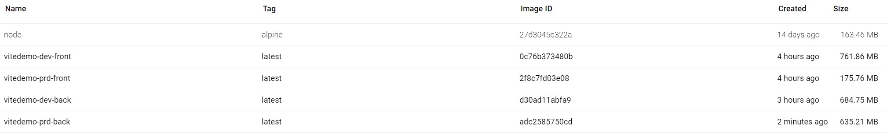

# Practice using Docker and Vite together

There aren't many tutorials out there explaining how Docker and Vite interact with each other when it comes to passing environment variables throughout the build and deployment process and how they handle networking.

This project demonstrates how to set up both a frontend and backend project that utilizes Docker Compose Watch and Vite HMR.  These two dev tools enable:
- Faster development by being able to see the effect of code changes without having to wait for comprehensive rebuilds
- A streamlined, more efficient build chain managed by Vite and Docker caches
- A standardized dev environment provided by Docker's images
- Future potential for scalability through Kubernetes
- Potential for self-healing and self-coordinated systems through Docker compose

## Future Goals

- [ ] Add code to [the backend](./back/src/main.ts) that prevents direct connections from unauthorized origins
    - Investigate [helmetjs](https://github.com/helmetjs/helmet) as a security option

## How to run

1. Install Docker
2. Clone repo and open its directory up in a terminal
3. Use a launch command:
    - To run in development mode with Docker Compose Watch and Vite HMR functionality, use:
        - `docker compose --profile dev up --watch`
    - To serve a built version of the project using [http-server](https://github.com/http-party/http-server) on the frontend and Node on the backend, use:
        - `docker compose --profile prd up -d`
    - To use Vite locally without involving Docker:
        1. `yarn install` in both the ./front and ./back directories
        2. `yarn dev` in one terminal each for ./front and ./back
    - To build and serve the project locally:
        1. Install Node
        2. `yarn build` both ./front and ./back directories
        3. Copy the backend's [secrets.json](./back//secrets.json) to `./back/dist/` and remove the `.json` extension from the filename
        4. Serve the backend from `./dist` with `Node main.cjs`
        3. Host the frontend with either `yarn preview` or `npx http-server ./dist -p 8080`
4. Navigate to [localhost:8080](http://localhost:8080) in a browser to see the page served by the container
5. In the browser's developer console, you'll see an Object output showing what environment variables Vite has injected into the app
7. Follow directions on the webpage to test out containerized HMR and container secrets handling
6. Stop and clean out the compose project with `docker compose --profile <dev/prd> down --rmi all`

## How to test the backend container without a frontend

**First**, build and start the container with either:
- `docker compose up dev-back -d`
    - You can alter the backend's source code and Vite and Docker will dynamically rebuild and re-host the changes when using this command.
    - Note that the container's Vite instance prints the port it's serving through from the *container's* perspective.  Pay attention to what host port is providing a connection to the container in the [compose.yaml](./compose.yaml) file.

**Then**, using something like Powershell or `curl` in a shell, respectively:

```powershell
$headers=@{}
$headers.Add("Content-Type", "application/json")
$response = Invoke-WebRequest `
    -Uri 'http://localhost:8081/secret' `
    -Method POST `
    -Headers $headers `
    -Body '{"name": "SECRET"}'
$response.Content
```

```bash
curl \
  --url http://localhost:8081/secret \
  --request POST \
  --header 'Content-Type: application/json' \
  --data '{"name": "SECRET"}'
```

This will print "secretValue" to the terminal, which the backend reads from the secrets file mounted by Docker compose.  Note that the Powershell commands will create variables that will persist in the terminal instance, `$headers` and `$response`.

## Demonstrating Container Restarts On Failure

[Compose restart](https://docs.docker.com/reference/compose-file/services/#restart) is used in [common.yaml services:node-base](./common.yaml) as `restart: on-failure:2` to cause the containers to attempt to start a container up to 3 times.  You can verify this by inspecting the container after it is built; there will be a "RestartPolicy" element present.  On initial successful startup, there will also be a "RestartCount" element whose value is 0.

To test the Docker Daemon's restart response, you can simulate a failure by executing a kill command from within the container.  First, identify the main process of the container with either `ps` or `top` (exit the top linux program with 'q' | [manual](https://man7.org/linux/man-pages/man1/top.1.html)), then kill it with `kill <pid>`.  You should see the container automatically restart and the "RestartCount" in docker inspect increment.  You can repeat this up to 3 times before the daemon stops restarting the container.

## Handling secrets

Secrets should't be mounted by Docker to the frontend.  A browser is incapable of accessing any files that aren't directly served to them.  Node's `fs` library is only usable by backend Node applications, not browser clients.

This project demonstrates a possible solution for storing secrets in the application.  The frontend on `localhost:8080` has to retrieve secrets from the backend Node application, which [*can* read mounted files](./back/src/api/secrets.ts), by sending a request to `localhost:8081/secret`.  Note that localhost and the ports referenced above are treated as the *host* and its ports, not the containers' ports.

## Networking issues

The [compose.yaml network](https://docs.docker.com/reference/compose-file/networks/) feature isn't very useful for this application.  Docker networks are closed networks, but when we access the application from our browser, we're trying to connect from outside of that closed network and we end up blocked.  When requesting a secret in the browser, the frontend redirects the browser client's request to the backend, which is treated as a communication from outside of the closed network.  Because of this, both the frontend and the backend needs to be open to outside connections, meaning we need to specify ports for both of them.  We can't use Docker's `expose`.

This means that the backend needs to have some sort of security measure to block unwanted requesters from its secrets.  The Express.js CORS middleware could be a part of this security solution.  CORS only prevents access from an origin redirected by another node (client being redirected by browser) that isn't on the allowed origins list.  In a real deployment, the developer would need to disallow direct connections from any origin other than the frontend.

This project's backend utilizes an [accessPolicy.ts](./back/src/accessPolicy.ts) that defines an Express middleware function that only allows requests that've been redirected by the frontend to the backend.  This tries to prevent direct access to the exposed backend port when the NODE_ENV is 'production'.

To get a Docker network to work, the communications between services need to be strictly between those services.  The service that exposes itself to outside connections needs capabilities that typical Node web apps aren't allowed.

Switching port numbers can sometimes cause issues with Vite.  When changing them, make sure to check what container port Vite ends up using by inspecting the container's logs and that `compose.yaml` correctly connects it to the expected host port.

## Vite troubles and their fixes

Vite doesn't seem to play well with this project's chosen environment (Node version, Docker base image, etc.) out of the box.  It can build just fine from within a container, but using any other command results in an error because Vite is restricted from accessing various packages in node_modules when it tries to run.  I've solved this issue of Vite not having enough permissions to launch itself in the container by changing the file permissions of it and all of its dependencies. (See the [Dockerfile](./front/Dockerfile)'s first `COPY` and `RUN` statements in its `dev-stage`).

`yarn dev` and `yarn preview` only work with a specific host value, `0.0.0.0`, in our chosen container environment (`node:alpine`).  It does not work with `localhost` as its value.  It could be because of the way recent versions of Node resolve domain names (see [vite.config server.host documentation](https://vite.dev/config/server-options.html#server-host)).

The port values of either the host or the container can seemingly be changed to any non-reserved port at will.  They don't have to match, but I match them in this project for convenience.

A major plugin for this project's backend, [vite-plugin-node](https://github.com/axe-me/vite-plugin-node), hasn't been able to keep up with the latest web dev tooling updates.  It is flagged by tsc's type checking.  Vite 6 is mostly backwards compatible so we can still use it to build the project without issue if we skip tsc type checking.  I removed the tsc step from the "build" script in [./back/package.json](./back/package.json); it is preserved in the "build-strict" script.

## Selectively running services from a Docker compose.yaml file

Specifically named services can be run with a `docker compose <command> <service-name>` command.  If a service has any dependencies named in its `depends_on:` attribute, those services will be built even if they weren't named in the command.

This project demonstrates how to define "profile" tags to operate a select group of services.

## Using Docker compose.yaml extends and fragments to reduce code duplication

**[extends](https://docs.docker.com/compose/how-tos/multiple-compose-files/extends) is a way for containers to utilize inheritance.**
- "Parents" can be defined either in a [separate .yaml file](./common.yaml) or the [main compose.yaml file](./compose.yaml).  If defined in the main file, the parent service will be considered part of the compose project and built along with its children; this is typically unwanted behavior.
- If a parent declares a secret for its children to mount, that secret source file must be declared in the main compose file.
- Attributes can be overridden or added to the inherited config at any level.

**[fragments](https://docs.docker.com/reference/compose-file/fragments/) utilize YAML merge to make shallow copies of attribute sets**
- Copied values are only 1 level deep.  Any nested attributes like build:args:___ are not copied over
- Fragments are also incapable of propagating anything not in the "mapping" yaml syntax `name: value`.  Attributes defined with the "sequence" syntax `- name: value` (anything preceded by a dash) are not copied over.

If you are ever having trouble with a compose file, you can try debugging its final form with `docker compose [--profile ___ ] config`.  This will output the compiled yaml text to the terminal so you can see what attributes your service will be built with.  This can be helpful for checking if an attribute is properly inherited, overridden, or appended. 

## Understanding how environment variables are injected

Docker is capable of injecting variable values at either build time or run time and when using Vite, it matters when it does so.  Vite hard-codes any `import.meta.env...` references we have in our code using the values we provide at *build* time.

With Docker, we can only supply build-time values from within Dockerfiles.  We can get away with storing our values in a compose.yaml file if we [call for ARGs in our Dockerfile](./front/Dockerfile) and [provide them within a compose service's `build` element](./compose.yaml).

Run-time environment variables don't seem to be accessible by Node apps, so a compose service's environment attribute is useless for this context.  This is different behavior from [docker/secrets's](../secrets/) demo, notably because it uses a Node *script* instead of an app.

## Multi-stage builds in Dockerfiles

This project also demos how we can create lean Docker images by separating a Node app's build tools from its final server image (showcased in the [Dockerfile](./front/Dockerfile)).  The only files the final server image needs are found in the `./dist` folder and whatever it needs to serve those files.



Comparing image sizes in the above image, we can see that the base image, node:alpine, is very slim.  The production image of the frontend is only ~10mb larger.  The backend's production image is almost half a gb larger than the base image.  We only save ~50mb between the backend's development and production builds.

## Docker container health checks

[Health checks](https://docs.docker.com/reference/compose-file/services/#healthcheck) are commands run on a container to check its status every interval.  These can be simple linux commands or entire test suites.  For instance, a dev could string multiple curl commands together in a [linux shell script](https://www.geeksforgeeks.org/sh-file-format/) to test all end points.  Docker's health check would then periodically run this script to check a container's responsiveness.  Failures don't stop a container, but they are reported in `docker inspect` or `docker ps` as being "unhealthy".  A maintainer could then see this status and investigate further to ensure their service is actually fully working.  In a real deployment, the interval should be much greater so as to not eat up processing power.

Health checks rely on the exit codes of the commands it runs.  Anything other than exit code 0 is regarded as a failure.  It's important that we are aware of what exit code is issued by the scripts we use to check a container's health.  In linux, you can check the last exit code received by the shell with `echo $?`; in Powershell, you can use `$LASTEXITCODE`.

Note how I explicitly chose to write the health check's test command in YAML's sequence syntax so that I can more easily break the curl command string up into multiple lines ([a YAML "block scalar"](https://yaml-multiline.info/)) for easier reading.  Credit for the syntax explanation goes to [this StackOverflow thread](https://stackoverflow.com/a/21699210/13084818).

[curl's -f option](https://curl.se/docs/manpage.html#-f) is used in the test command to cause request failures to not print a full response body.

### How to test health checks

1. Use `docker compose up hc-back -d`
2. Use docker inspect to view the `State.Health` element or user `docker ps` to see the container's health.
3. Try demoing an "unhealthy" container by changing the test to always fail
    - Add an extra character to the url argument so that we attempt to access the wrong endpoint
    - After 10 seconds of startup grace time, the failures will begin counting towards an unhealthy status
4. Clean up with `docker compose down hc-back --rmi all`